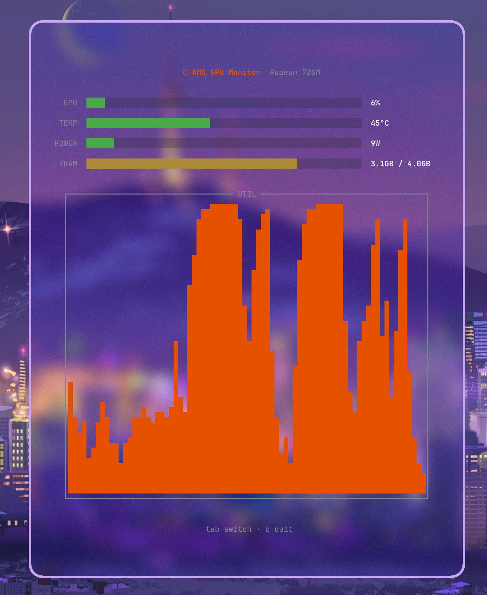

# amdtop

AMD GPU monitor for Linux and Windows with a terminal UI.

[中文文档](README_CN.md)



## Features

- Real-time GPU metrics: utilization, temperature, power draw, VRAM usage
- Smooth spring-animated gauges and bar charts
- History chart switchable between utilization, temperature, power, and VRAM
- Automatically adapts to small terminals (compact mode with gauge/chart toggle)
- Server / Client mode for remote monitoring via HTTP API
- Fully customizable colours via config file

## Download

Pre-built binaries are available on the [Releases page](https://github.com/zyoung11/amdtop/releases).

### Linux

Download `amdtop-linux-amd64`, make it executable:

```bash
chmod +x amdtop-linux-amd64
./amdtop-linux-amd64
```

No extra dependencies — reads GPU data from sysfs (amdgpu kernel driver).

### Windows

Download `amdtop-windows-amd64.exe` and run it. Requires AMD GPU driver with `ADLX.dll` (included with driver, located in `C:\Windows\System32\`).

### Build from source

```bash
git clone https://github.com/zyoung11/amdtop.git
cd amdtop
```

**Linux:**

```bash
go build -ldflags="-s -w" .
```

**Windows** (requires [MinGW-w64](https://www.mingw-w64.org/) for cgo):

```powershell
go build -ldflags="-s -w" .
```

## Usage

```
amdtop                         local TUI mode
amdtop -s -p <port>            server mode (TUI + HTTP API on port)
amdtop -c -i <ip> -p <port>    client mode (connect to remote server)
amdtop -h, --help              show help
```

### Local mode

```bash
./amdtop
```

Controls: `Tab` to cycle chart data, `q` to quit.

### Server mode

Starts the TUI and a HTTP API on the specified port.

```bash
./amdtop -s -p 16969
```

The port is saved to the config file after first use; subsequent runs may omit `-p`.

API endpoint: `GET /api/v1/metrics` returns a JSON object with all GPU metrics.

### Client mode

Connects to a remote server and displays its GPU data.

```bash
./amdtop -c -i 192.168.100.1 -p 16969
```

IP and port are saved after first use; subsequent runs may omit `-i` and/or `-p`.

## Configuration

The config file is located at `~/.config/amdtop/config.json`. It is automatically created with defaults on first run.

```json
{
  "title_color": "#e65100",
  "gauges": {
    "gpu":   "default",
    "temp":  "default",
    "power": "default",
    "vram":  "default"
  },
  "charts": {
    "util":  "#e65100",
    "temp":  "#e65100",
    "power": "#e65100",
    "vram":  "#e65100"
  },
  "default_chart": "util",
  "server_color": "#4aa84a",
  "client_color": "#58a6ff",
  "poll_interval_ms": 1000,
  "client_poll_interval_ms": 1000
}
```

### Gauge colours

Set a gauge to `"default"` to use automatic green/yellow/red switching based on value.
Use a hex colour (e.g. `"#e65100"`) to pin it to a fixed colour.

### Chart colours

Four chart types (util, temp, power, vram) each have their own colour.
All default to `#e65100` (AMD orange).

### Poll intervals

- `poll_interval_ms` — data collection interval in local / server mode (default `1000`). Minimum `100`.
- `client_poll_interval_ms` — HTTP polling interval in client mode (default `1000`). Minimum `100`.

### Server / Client connection

```json
"server": {
  "port": 16969
},
"client": {
  "ip": "192.168.100.1",
  "port": 16969
}
```

- `server.port` — port the server listens on. Set automatically when using `-s -p <port>`, or edit manually.
- `client.ip` — remote server IP address. Set automatically when using `-c -i <ip>`, or edit manually.
- `client.port` — remote server port. Set automatically when using `-c -p <port>`, or edit manually.

## License

MIT
